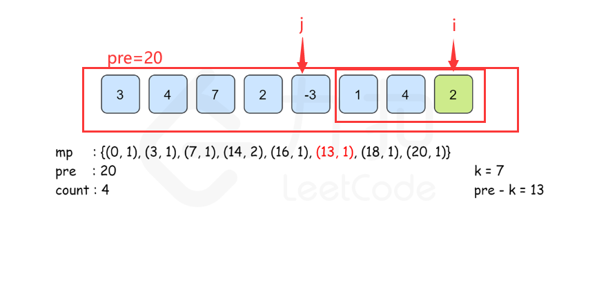

# 滑动窗口

滑动窗口的题大部分都可以套用模板：
[SlidingWindowFramework.java](src%2Fcom%2Fgodtong%2Fslidingwindow%2FSlidingWindowFramework.java)

## 76. 最小覆盖子串

[p76](src%2Fcom%2Fgodtong%2Fslidingwindow%2Fp76)

## 438. 找到字符串中所有字母异位词

[p438](src%2Fcom%2Fgodtong%2Fp438)

这道题和*76. 最小覆盖子串*大部分内容都一样，主要就是while循环条件不一样。

76题：所有有效字符都找到了，才会收缩窗口。

本题窗口内的字符数大于，要查找的字符：p，窗口左边就会缩小。及时收缩窗口是为了保证没有多余的字符被记录。

valid变量保存的是有效字符数。valid == need.size()，就说明了窗口中，对应的字符数量和要查找的字符：p相同！

## 567. 字符串的排列

[p567](src%2Fcom%2Fgodtong%2Fslidingwindow%2Fp567)

这道题和438题差不多

# 子串

## 560. 和为 K 的子数组

[p560](src%2Fcom%2Fgodtong%2Fp560)

### 我的解答

[Solution.java](src%2Fcom%2Fgodtong%2Fp560%2FSolution.java) 这个思路错误，没考虑到负数的情况

### 根据题解的解答

https://leetcode.cn/problems/subarray-sum-equals-k/solutions/238572/he-wei-kde-zi-shu-zu-by-leetcode-solution

[Solution1.java](src%2Fcom%2Fgodtong%2Fp560%2FSolution1.java) 暴力解法

[Solution2.java](src%2Fcom%2Fgodtong%2Fp560%2FSolution2.java) 前缀和 + 哈希表优化（没太懂）

主要思路就是，pre[j−1]==pre[i]−k。

## 239. 滑动窗口最大值
[p239](src%2Fcom%2Fgodtong%2Fp239)

### 我的解答

[Solution.java](src%2Fcom%2Fgodtong%2Fp239%2FSolution.java) 错误！未通过测试用例

### 根据题解的解答

https://leetcode.cn/problems/sliding-window-maximum/solutions/543426/hua-dong-chuang-kou-zui-da-zhi-by-leetco-ki6m

[Solution1.java](src%2Fcom%2Fgodtong%2Fp239%2FSolution1.java) 方法一：优先队列
[Solution2.java](src%2Fcom%2Fgodtong%2Fp239%2FSolution2.java) 方法二：单调递减队列
